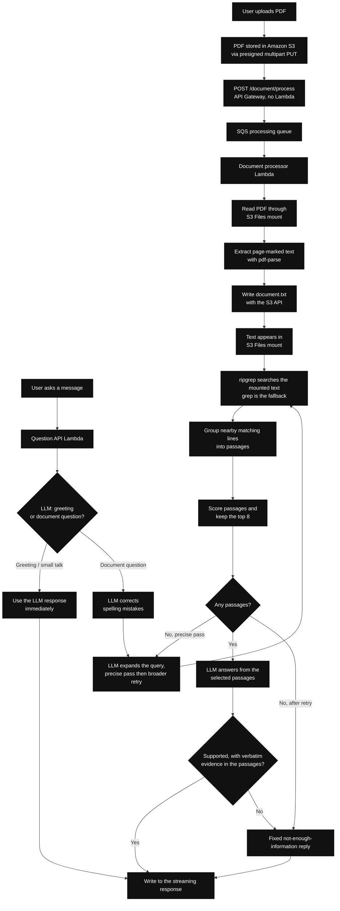

# Grepping

Grepping lets a user upload a PDF and ask questions about it. It stores the PDF in Amazon S3, turns it into
page-marked text, searches that text with `ripgrep`, and uses an LLM to produce an answer from the best matching
passages.

## How it works



### File flow

1. The browser uploads the PDF directly to S3 using presigned multipart URLs.
2. The browser calls `POST /document/process`. API Gateway puts the message on SQS itself, with no Lambda in
   the write path, and returns `202` immediately.
3. A document-processing Lambda reads the PDF through the S3 Files mounted filesystem. The queue delays the
   first delivery by 30 seconds because an object written with the S3 API takes a moment to appear under the
   mount; redelivery is the propagation wait, and messages that never succeed land in a dead-letter queue.
4. The Lambda extracts page-marked text with `pdf-parse` and writes `document.txt` with the S3 API, not through
   the mount: the access point pins uid/gid 1000, and the per-document directory created by the presigned PUT is
   not writable by that user.
5. S3 Files makes the extracted text available to the question Lambda as a mounted file.

### Question flow

1. The question Lambda first calls `classifyGreetingsAndRespond` on the LLM.
2. If the message is a greeting, thanks, or small talk, the LLM response is returned immediately. No file search
   or retrieval happens.
3. If it is a document question, `correctSpelling` fixes spelling and typing mistakes without changing the intent.
   A document question without a `documentId` is rejected with HTTP 400.
4. The LLM expands the corrected query with related terms and phrases.
5. `ripgrep` searches the mounted text file using those terms, capped at 12 terms with stop words dropped. If the
   `rg` binary is not on the Lambda, the search falls back to `grep -E`.
6. Nearby matching lines are grouped into passages, scored, and cut to the top 8.
7. If the precise expansion produced no passages, steps 4 to 6 run a second time with a deliberately broader
   expansion. If that pass also finds nothing, the fixed "not enough information" reply is returned without
   calling the answering model.
8. The LLM receives the selected passages and writes an answer only from that evidence.
9. The answer is only used when the model marks it supported and every evidence excerpt appears verbatim in the
   passages. Otherwise the same fixed "not enough information" reply is returned.
10. The reply is written to the streaming response. The transport streams, but the model output is buffered and
    validated first, so the answer arrives as a single chunk rather than token by token.

## AWS services used

- Amazon S3 stores the original PDFs and extracted text.
- S3 Files exposes the S3 bucket as a mounted filesystem for Lambda.
- API Gateway receives uploads, processing requests, and questions.
- Lambda handles document processing and question answering.
- SQS keeps PDF extraction asynchronous, with a dead-letter queue for messages that fail five deliveries.
- Amazon Bedrock provides greeting classification, spelling correction, query expansion, and answer generation.
- An S3 gateway endpoint and Bedrock Runtime interface endpoint provide private VPC access without a NAT Gateway.

## Run locally

Prerequisites: Node.js 22+, AWS SAM CLI, the AWS CLI with credentials configured (`scripts/update-frontend-config.sh`
and `scripts/destroy.sh` call `aws` and run under `bash`), and an AWS account with the S3 Files resource types. The
frontend is served locally by the Node.js command `npm run frontend:dev`.

```bash
npm install
npm run deploy
npm run frontend:dev
```

`npm run deploy` validates the SAM template, builds the Lambdas, deploys the stack, and generates the frontend
API configuration. The default deployment settings are stored in `samconfig.toml`, including:

```text
LLMProvider=bedrock
LLMModel=amazon.nova-lite-v1:0
```

No manual Bedrock parameter is needed for the normal deployment. `samconfig.toml` sets `confirm_changeset = true`,
so `sam deploy` pauses for a changeset confirmation. `npm run frontend:config` is already called by
`npm run deploy`; the final command starts the frontend separately.

Open <http://localhost:5173>.

## Technical consideration

The question Lambda runs inside a VPC and reaches Amazon Bedrock through a private Bedrock Runtime interface
VPC endpoint. This project intentionally does not configure a NAT Gateway. As a result, the current deployment
works with Bedrock but cannot make direct outbound calls to OpenAI, Anthropic/Claude, or other public LLM APIs.

Supporting those providers requires adding an outbound internet path, such as a NAT Gateway, and configuring the
provider API key through Secrets Manager.

## Deployment parameters

`AllowedValues: [openai, anthropic, bedrock]` is CloudFormation validation. It means `LLMProvider` accepts only
those three provider names; it does not mean all three providers work with the current network configuration.
The code has adapters for all three, but the deployed VPC currently supports Bedrock because it has a private
Bedrock endpoint and no NAT Gateway. `IsBedrockProvider` creates that endpoint only when `LLMProvider=bedrock`.

`LLMSecretArn` is empty for Bedrock. It is needed only when using OpenAI or Anthropic after adding outbound
network access, and must point to a Secrets Manager secret containing an `apiKey` field.

`RipgrepLayerArn` is empty by default, so the deployed functions have no `rg` binary and retrieval runs on the
`grep` fallback in `RipgrepTextSearch`. Point it at a Lambda layer containing `rg` to search with real `ripgrep`.

`FrontendOrigin` defaults to `http://localhost:5173` and is the single browser origin allowed to call the API.
Change it when serving the frontend from anywhere else, including a different port via `FRONTEND_PORT`.

## Important limitation

This is a demo. The API has no login or authentication, and the browser-provided `x-user-id` is only a document
namespace. Do not upload sensitive documents.
