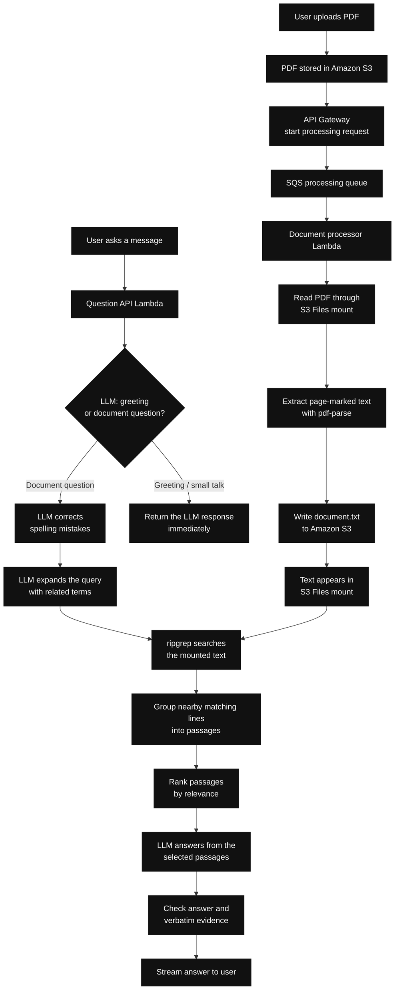

# Grepping

Grepping lets a user upload a PDF and ask questions about it. It stores the PDF in Amazon S3, turns it into
page-marked text, searches that text with `ripgrep`, and uses an LLM to produce an answer from the best matching
passages.

## How it works



### File flow

1. The browser uploads the PDF directly to S3 using presigned multipart URLs.
2. The browser calls the processing API. API Gateway places a message on SQS and returns immediately.
3. A document-processing Lambda reads the PDF through the S3 Files mounted filesystem.
4. The Lambda extracts page-marked text with `pdf-parse` and writes `document.txt` to S3.
5. S3 Files makes the extracted text available to the question Lambda as a mounted file.

### Question flow

1. The question Lambda first calls `classifyGreetingsAndRespond` on the LLM.
2. If the message is a greeting, thanks, or small talk, the LLM response is returned immediately. No file search
   or retrieval happens.
3. If it is a document question, `correctSpelling` fixes spelling and typing mistakes without changing the intent.
4. The LLM expands the corrected query with related terms and phrases.
5. `ripgrep` searches the mounted text file using those terms.
6. Nearby matching lines are grouped into passages and ranked by relevance.
7. The LLM receives the selected passages and writes an answer only from that evidence.
8. The answer is checked for matching evidence and streamed back to the browser.

## AWS services used

- Amazon S3 stores the original PDFs and extracted text.
- S3 Files exposes the S3 bucket as a mounted filesystem for Lambda.
- API Gateway receives uploads, processing requests, and questions.
- Lambda handles document processing and question answering.
- SQS keeps PDF extraction asynchronous.
- Amazon Bedrock provides greeting classification, query expansion, and answer generation.
- An S3 gateway endpoint and Bedrock Runtime interface endpoint provide private VPC access without a NAT Gateway.

## Run locally

Prerequisites: Node.js 22+, AWS SAM CLI, Python 3, and an AWS account with the S3 Files resource types.

```bash
npm install
npm run lint
npm run typecheck
npm run build
```

Deploy with Bedrock:

```bash
sam deploy --guided \
  --parameter-overrides \
  LLMProvider=bedrock \
  LLMModel=amazon.nova-lite-v1:0 \
  FrontendOrigin=http://localhost:5173
```

Then configure and start the frontend:

```bash
npm run frontend:config
npm run frontend:dev
```

Open <http://localhost:5173>.

## Important limitation

This is a demo. The API has no login or authentication, and the browser-provided `x-user-id` is only a document
namespace. Do not upload sensitive documents.
