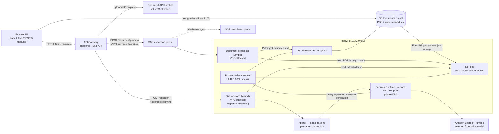

# TraceRAG

## Architecture



TraceRAG is a document question-answering demo built with AWS SAM. It deliberately avoids embeddings, vector
databases, OpenSearch, and a retrieval index. PDFs are stored in Amazon S3 and exposed to the VPC Lambdas
through Amazon S3 Files. Retrieval runs directly against page-marked text with `ripgrep`, then a
provider-agnostic LangChain adapter asks an LLM to produce a strictly evidence-backed answer.

The deployed stack is intentionally small and test-oriented: the retrieval VPC has one private subnet in one
Availability Zone, no NAT Gateway, and no authentication layer. It is not a production high-availability or
multi-tenant configuration.

## Request and response flows

### 1. PDF upload and asynchronous extraction

```text
Browser
  │
  ├─ GET /document ────────────────────────────────► Document API Lambda ──► S3 list
  │
  ├─ POST /document/upload/init ──────────────────► Document API Lambda
  │                                                    │
  │                                                    └─ Create multipart upload
  │
  ├─ POST /document/upload/part-url ───────────────► Document API Lambda
  │◄─ presigned S3 URL ────────────────────────────┘
  │
  ├─ PUT each 8 MiB part directly to S3
  ├─ POST /document/upload/complete ───────────────► Document API Lambda
  │
  └─ POST /document/process ──► API Gateway SQS integration ──► SQS ──► 202
                                                                  │
                                                                  ▼
                                              Document processor Lambda in VPC
                                                                  │
                                              S3 Files mount reads original.pdf
                                                                  │
                                              pdf-parse extracts page-marked text
                                                                  │
                                              S3 PutObject writes document.txt
```

1. The browser asks the Document API Lambda for a multipart upload and presigned part URLs.
2. The browser uploads PDF parts directly to S3; the API never proxies the file bytes.
3. The browser calls `/document/process`. API Gateway sends the job directly to SQS, so the request path
   returns `202` without waiting for PDF extraction or invoking a Lambda synchronously.
4. The processor Lambda consumes one queue message, reads the PDF through the S3 Files mount, extracts text
   with `pdf-parse`, and writes `document.txt` beside the original PDF using the S3 API.
5. The browser polls `GET /document` until the extracted text object exists. S3 object presence is the document
   status; there is no database.

S3 Files requires S3 EventBridge notifications to keep the mounted namespace synchronized with objects written
through S3 APIs. The template enables that bucket-level EventBridge configuration.

### 2. Question, retrieval, and streamed answer

```text
Browser
  │ POST /question { documentId, question }
  ▼
API Gateway response streaming
  ▼
Question API Lambda in private subnet
  │
  ├─ Read documents/<userId>/<documentId>/document.txt through S3 Files
  ├─ Ask Bedrock for a cautious query expansion
  ├─ Run ripgrep over the mounted text
  ├─ Build, pad, score, and rank nearby passages
  ├─ Ask Bedrock to answer only from those passages
  └─ Validate returned evidence and stream the final answer
  │
  ▼
Browser receives the answer over the open HTTP response
```

The normal question path makes one model call for query expansion and one streaming model call for the final
answer. If precise lexical retrieval returns no passages, the retriever performs one broader, still cautious
query expansion. The answer parser rejects model output that is not valid JSON, does not claim support, or does
not contain verbatim evidence from the retrieved passages. Rejected or unsupported questions return:

```text
The PDF does not provide enough information to answer that question.
```

The browser carries a UUID in the `x-user-id` header. This is only a document namespace, not authentication or
authorization. S3 keys are partitioned as:

```text
documents/<userId>/<documentId>/original.pdf
documents/<userId>/<documentId>/document.txt
```

## Network and cost design

The two Lambdas that need the mounted document filesystem run in `RagVpc`:

| Network component                  | Purpose                                                                |
| ---------------------------------- | ---------------------------------------------------------------------- |
| `RagVpc`                           | `10.42.0.0/16` VPC for retrieval and extraction workloads              |
| `RetrievalSubnetA`                 | `10.42.1.0/24` private subnet; single-AZ test deployment               |
| S3 Files mount target              | Makes the S3 bucket available as a POSIX-compatible mount              |
| S3 gateway endpoint                | Private, route-table-based S3 API access without NAT                   |
| Bedrock Runtime interface endpoint | Private HTTPS path from the question Lambda to Bedrock                 |
| Retrieval security group           | Allows NFS `2049` for the mount and HTTPS `443` for interface services |

### Why there is no NAT Gateway for Bedrock

The question Lambda is VPC-attached because it needs the S3 Files mount. In a typical private-subnet design,
the Lambda would need a NAT Gateway to reach the public Bedrock endpoint. This template instead creates an
`AWS::EC2::VPCEndpoint` for `com.amazonaws.<region>.bedrock-runtime` with `VpcEndpointType: Interface` and
private DNS enabled when `LLMProvider=bedrock`.

That keeps Bedrock traffic on the AWS private network and avoids provisioning NAT Gateway hourly charges and
NAT data-processing charges for this path. The interface endpoint is not free: it has its own hourly-per-AZ
and data-processing pricing. For this small, single-AZ demo, the endpoint is the deliberate cost and security
trade-off. A production deployment should evaluate endpoint coverage across AZs, expected traffic, endpoint
pricing, and availability requirements.

The S3 gateway endpoint is also used for private S3 API traffic and has no hourly endpoint charge. The template
does not create a NAT Gateway. OpenAI and Anthropic providers are supported by the code, but their public APIs
require an outbound internet path and API keys from Secrets Manager; this no-NAT VPC is therefore intended to
be deployed with Bedrock unless additional egress networking is added.

## AWS services

| Service                | Role in this project                            | Important implementation detail                                                                                |
| ---------------------- | ----------------------------------------------- | -------------------------------------------------------------------------------------------------------------- |
| Amazon API Gateway     | Regional REST API and response streaming        | Routes document operations to Lambda, sends extraction jobs directly to SQS, and streams `/question` responses |
| AWS Lambda             | Document API, question API, and queue processor | Node.js 22 on arm64; question and processor functions use the VPC and S3 Files mount                           |
| Amazon S3              | Durable PDF and extracted-text storage          | Versioning, AES-256 server-side encryption, public access block, CORS, and incomplete multipart cleanup        |
| Amazon S3 Files        | POSIX-compatible view of the S3 bucket          | Mounts the bucket into the two VPC Lambdas; EventBridge synchronization is enabled                             |
| Amazon SQS             | Asynchronous extraction handoff                 | 30-second delay allows S3 Files propagation; 150-second visibility timeout; five receives before DLQ           |
| Amazon SQS DLQ         | Failed extraction isolation                     | Retains failed messages for 14 days                                                                            |
| Amazon Bedrock Runtime | Query expansion and answer generation           | Access is limited by IAM to the configured foundation model; reached through a VPC interface endpoint          |
| AWS Secrets Manager    | External-provider API key storage               | Used for OpenAI or Anthropic credentials; not needed for Bedrock                                               |
| Amazon EventBridge     | S3 Files synchronization trigger                | S3 bucket notifications are enabled for S3 Files-managed synchronization                                       |
| Amazon CloudWatch Logs | Lambda logging                                  | Explicit 14-day retention is configured for all three application Lambdas                                      |
| AWS IAM                | Service-to-service permissions                  | Separate roles scope S3, SQS, S3 Files, Bedrock, Secrets Manager, and logging access                           |

## Infrastructure resources

`template.yaml` is the source of truth and provisions:

- One encrypted, versioned S3 bucket for originals and extracted text.
- One S3 Files filesystem, access point, mount target, and filesystem policy.
- One SQS extraction queue and one dead-letter queue.
- One regional API Gateway REST API.
- `DocumentApiFunction` for listing documents, multipart-upload control, and presigning.
- `QuestionApiFunction` for mounted-file retrieval, LLM calls, evidence validation, and response streaming.
- `DocumentProcessingFunction` for SQS-driven PDF extraction.
- A VPC, private subnet, route table, S3 gateway endpoint, conditional Bedrock interface endpoint, security
  group, and mount networking.
- IAM roles and CloudWatch log groups with 14-day retention.

## Code structure

```text
template.yaml                         SAM/CloudFormation infrastructure
frontend/                             static HTML, CSS, and browser ES modules

src/
  handlers/                            thin Lambda entry points
    api/document.ts                    API Gateway document handler
    api/question.ts                    API Gateway streaming handler
    queue/document-processor.ts        SQS handler
  core/                                request/event processors
    api/document.ts                    document route dispatch
    api/question.ts                    question validation + streaming
    queue/document-processor.ts        queue record handling
  services/                            business capabilities
    documents/                         upload, status, extraction, PDF text
    questions/                          question orchestration
    retrieval/                          query, passages, ranking
    llm/                                expansion, answer prompts, validation
  infrastructure/                     AWS and external-system adapters
    filesystem/                         S3 Files mount access
    retrieval/                          ripgrep process adapter
    storage/                            S3 object and presigned URL adapter
    llm/                                LangChain provider adapter
  contracts/                           retained abstract LLM boundary
  types/                               domain and adapter types
  config/                              environment configuration
  utils/                               HTTP, identity, parsing, and S3 key helpers
```

Handlers only assemble dependencies and delegate. Core processors own request/event flow. Services own business
rules. Infrastructure classes isolate AWS SDK, filesystem, ripgrep, and LangChain details. This keeps the
retrieval algorithm testable without coupling it to API Gateway or a particular model provider.

## Retrieval implementation

The retrieval path is lexical rather than vector-based:

1. `LlmService.expandQuery` creates precise terms from the question without inventing entities.
2. `RipgrepTextSearch` escapes those terms and matches them against the mounted text file.
3. `PassageBuilder` groups nearby matching lines, adds context, and merges overlapping ranges.
4. `PassageScorer` ranks passages by term weight, coverage, and proximity.
5. `LlmService.streamAnswer` receives only the ranked passages and must return verbatim evidence.
6. `ModelOutputParser` rejects unsupported or unverifiable output and returns the fixed no-information message.

No passage, question, chat message, embedding, or answer is persisted. The browser keeps its visible chat history
in memory for the current page/session; starting a new session clears the UI and generates a new document namespace.

## Prerequisites

- AWS SAM CLI
- Node.js 22+
- Python 3 for serving the frontend locally
- An AWS account and region supporting the S3 Files resource types
- `rg` locally only if you want to run retrieval commands by hand (`brew install ripgrep`)

## Deploy

Install dependencies and validate locally:

```bash
npm install
npm run lint
npm run typecheck
npm run format:check
npm run build
```

Deploy the Bedrock configuration:

```bash
sam deploy --guided \
  --parameter-overrides \
  LLMProvider=bedrock \
  LLMModel=amazon.nova-lite-v1:0 \
  FrontendOrigin=http://localhost:5173
```

For OpenAI or Anthropic, pass `LLMProvider`, `LLMModel`, and `LLMSecretArn`, where the Secrets Manager value is:

```json
{ "apiKey": "your-provider-key" }
```

Bedrock does not require a secret. The template grants the question Lambda access only to the configured model
ARN. `RipgrepLayerArn` is optional; if omitted, the retrieval adapter falls back to the runtime's `grep`.

After deployment, generate the frontend API configuration and start the static UI:

```bash
npm run frontend:config
npm run frontend:dev
```

Open <http://localhost:5173>. The default stack name is `db-less-rag-demo`; pass another stack name to the
configuration script when needed:

```bash
npm run frontend:config -- another-stack-name
```

`npm run deploy` runs validation, SAM build/deploy, and frontend configuration update together. The generated
`frontend/config.js` is ignored by git and loaded with a cache-busting query.

## Cleanup

The demo uses delete policies for its versioned S3 bucket, so use the project cleanup script to empty the bucket
before deleting the stack:

```bash
npm run destroy
```

Pass a different stack name as the first argument if required:

```bash
bash scripts/destroy.sh another-stack-name
```

## Limitations and security notes

- The API has no Cognito, IAM authorizer, or application authentication. `x-user-id` is client-controlled and
  only provides namespacing; do not upload sensitive data.
- The VPC is single-AZ and intentionally not highly available.
- There is no NAT Gateway. Bedrock works privately through the interface endpoint; public LLM providers need
  additional egress networking.
- There is no persistent chat history, question table, vector index, or embedding store.
- The document processor is idempotent when extracted text already exists, and SQS redrives failures to the DLQ.
- S3 Files propagation is asynchronous, so the queue delay and document polling are part of the design.

## Serverless Design Decisions

- S3 multipart upload + presigned URLs -> keeps large file bytes off the API/Lambda request path.
- API Gateway -> SQS service integration -> provides an asynchronous extraction boundary without a Lambda hop.
- SQS + DLQ -> provides backpressure, retries, and isolation for failed PDF extraction.
- S3 Files -> exposes S3 documents as a mounted filesystem so retrieval can use `ripgrep` without an index.
- S3 gateway endpoint -> provides private S3 API access without a NAT Gateway.
- Bedrock Runtime interface endpoint -> provides private model access for the VPC Lambda and avoids NAT Gateway
  egress for Bedrock, with endpoint pricing and single-AZ availability as explicit trade-offs.
- Response streaming -> lets the question API send model output over the open API Gateway response.
- No database -> document status is derived from S3 objects and retrieval passages are ephemeral for this demo.
