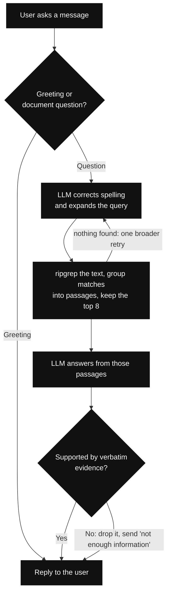

# Grepping

Grepping lets a user upload a PDF and ask questions about it. It turns the PDF into page-marked text, searches that
text with `ripgrep`, and uses an LLM to answer from the best matching passages.

## How it works



### Upload

The browser uploads the PDF straight to s3 using multi part upload and just make an api call to start processing job (Converting PDF is into
page-marked text and saved as `document.txt`).

### Question

Every message is classified first. Greetings and small talk are answered right away, with no search at all. A real
question has its spelling corrected and is expanded into related search terms. `ripgrep` finds the matching lines,
nearby matches are grouped into passages, and the best 8 are kept. If nothing matched, the query is expanded once
more, broader, and searched again.

The LLM then answers from those passages alone and has to quote the evidence it used. The answer is only sent when
every quote appears verbatim in the passages; otherwise the reply is that the PDF does not have enough information.

## Run locally

Prerequisites: Node.js 22+, the AWS SAM CLI, the AWS CLI with credentials configured, and an AWS account with the S3
Files resource types.

```bash
npm install
npm run deploy
npm run frontend:dev
```

`npm run deploy` builds the stack, deploys it, and writes the frontend API configuration. The default settings live
in `samconfig.toml`:

```text
LLMProvider=bedrock
LLMModel=amazon.nova-lite-v1:0
```

Open <http://localhost:5173>.

## Technical consideration

The stack reaches Amazon Bedrock through a private VPC endpoint and deliberately has no NAT Gateway. The deployment
therefore works with Bedrock but cannot call OpenAI, Anthropic/Claude, or other public LLM APIs directly. Supporting
those requires an outbound internet path and the provider API key in Secrets Manager.
Also don't forget to destroy the stack as vpc endpoint has a cost asociated to it.
